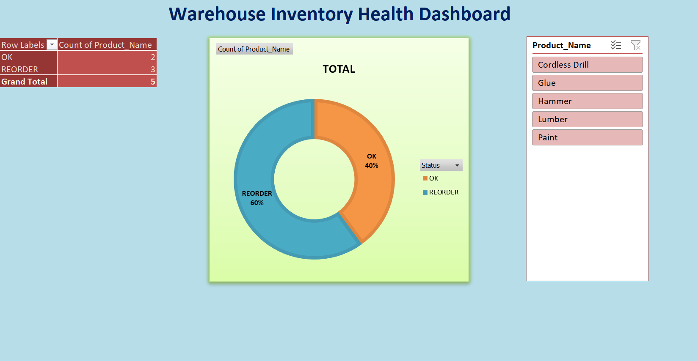

# Warehouse-Inventory-Analysis
Automated inventory reorder system using Python and Excel
## 🎯 Project Overview
This project solves a common supply chain problem: **knowing exactly when to restock items to avoid running out.** I used Python to handle the complex data generation and mathematical calculations, then exported the results into an interactive Excel Dashboard for business stakeholders.

## 🛠️ Tech Stack
* **Python (Pandas/NumPy):** Data cleaning, stock-level logic, and reorder point math.
* **Google Colab:** Development environment for the Python script.
* **Microsoft Excel:** Pivot Tables, Slicers, and Data Visualization.

---

## 📊 Interactive Dashboard

*Above: A preview of the interactive dashboard showing real-time stock status and reorder alerts.*

---

## 🧠 Key Features & Logic
I implemented the following logic to ensure the warehouse stays stocked:

1. **Automated Reorder Alerts:** Used NumPy to flag items as "REORDER NOW" if current stock falls below the calculated threshold.
2. **Safety Stock Buffer:** Programmed a 20% safety margin to account for shipping delays or sales spikes.
3. **Stock Runway Calculation:** A custom metric that predicts exactly how many days of inventory are left based on daily sales.

## 📂 Project Structure
* **Inventory_Project.ipynb**: The Python notebook containing the data processing logic.
* **inventory_analysis.xlsx**: The final data output used to power the dashboard.
* **warehouse-inventory-dashboard.png**: High-resolution screenshot of the final UI.

---

### How to use this project:
1. Open the `.ipynb` file to see how the data was transformed.
2. Download the `.xlsx` file to interact with the slicers and filters in Excel.
